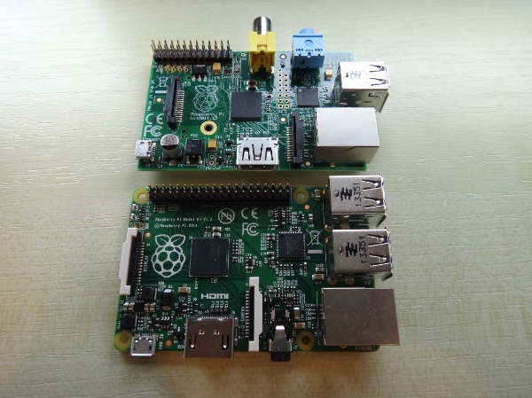
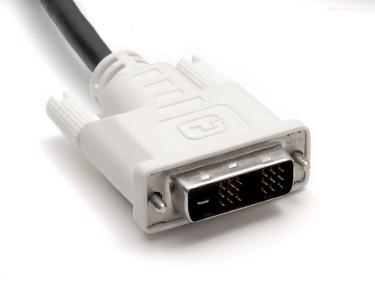
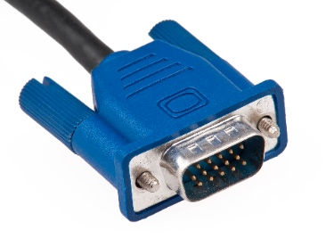

## Hardware required

### What you will need for a standalone class set of Raspberry Pis

- A number of Raspberry Pis; one between two can work depending on the work students are doing. Either [Model B](http://www.raspberrypi.org/product/model-b/) or [Model B+](http://www.raspberrypi.org/product/model-b-plus/).
- Enough [SD Cards or microSD Cards](http://swag.raspberrypi.org/collections/frontpage/products/noobs-8gb-sd-card) (Model B+) for each Pi.
- USB keyboards and mice for each Pi.
- [Micro USB power supply](http://swag.raspberrypi.org/collections/pi-kits/products/raspberry-pi-universal-power-supply) for each Pi.
- HDMI cable to connect to a monitor for each Pi (see Monitor Solutions below).
- A monitor for each Pi.

### Further items you will need for a networked class set of Raspberry Pis

- Ethernet cable connection
- Or a WiFi dongle (like [this one](http://thepihut.com/products/usb-wifi-adapter-for-the-raspberry-pi) from [The Pi Hut](http://thepihut.com/))

### Optional extras

- [Pi Hubs](http://shop.pimoroni.com/products/pihub) can be used to power more than one Raspberry Pi and provides extra USB slots.
- An SD card duplicator to copy SD card images to multiple cards. These are handy for making a class set. Unfortunately, they cost £500 or more.

## Monitor solutions

You could use existing school monitors with Raspberry Pis. You will need to check the cables to see if they have the correct connectors for the Pi.

- **HDMI** The Raspberry Pi outputs through a HDMI connector to a TV or monitor. Most modern TVs, monitors, and projectors use HDMI. However this is not always the case in classrooms, where technology is a few years older.

  

- **DVI** If the monitors in your classroom do not have a HDMI connector, but have a DVI connector, then you can purchase HDMI to DVI cables. This is an additional cost, but these cables are relatively inexpensive and replace the need for HDMI cables.

  

- **VGA** If you have equipment that is more than a few years old, then it is likely that the monitors will have VGA connectors. In this case you will need to get a VGA adaptor for the Raspberry Pi at an additional cost. It is recommended that before you make this choice you consider some of the solutions below for using the school network to connect to the Pis instead.

  
